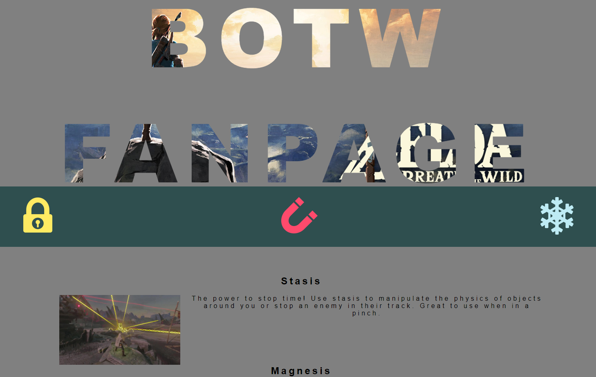

# Legend of Zelda themed practice template

A simple webpage used to practice trickier css styling techniques, such as super-imposing text over an image, or floating text the opposite direction of an image in the same div without using rows or columns. That being said, I primarily used this site to practice styling techniques when I was first getting back into the full swing of programming. As such, the result is fairly novice, and I have since learned better styling tools & practices to make some of these techniques obsolete. Enjoy!

Sneak a peek: https://94cooper94.github.io/superImposedText/